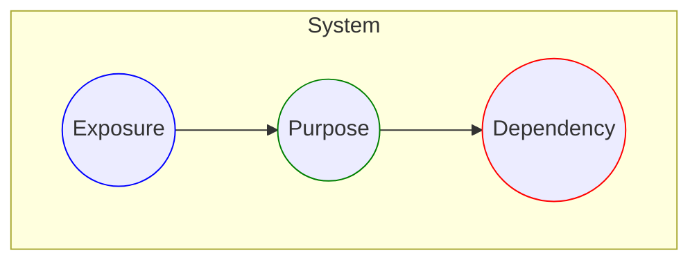
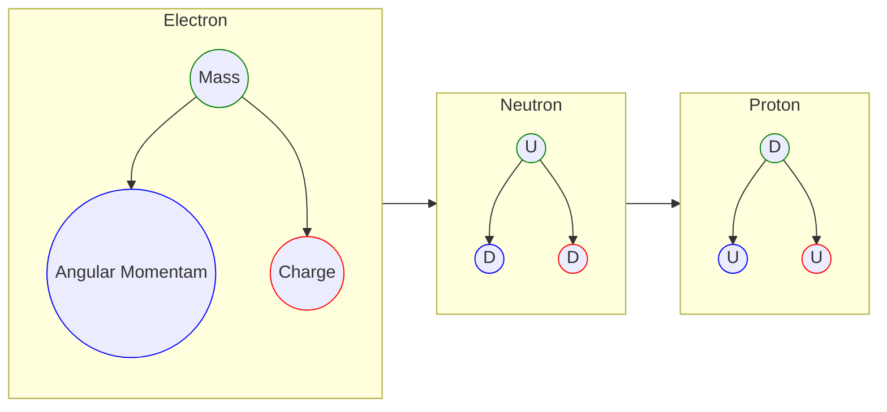
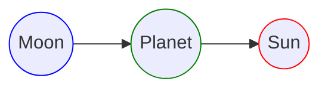
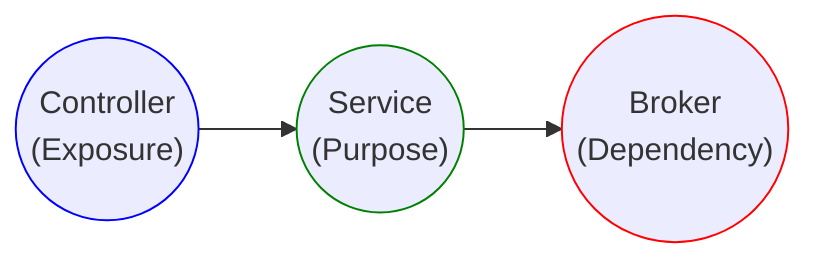
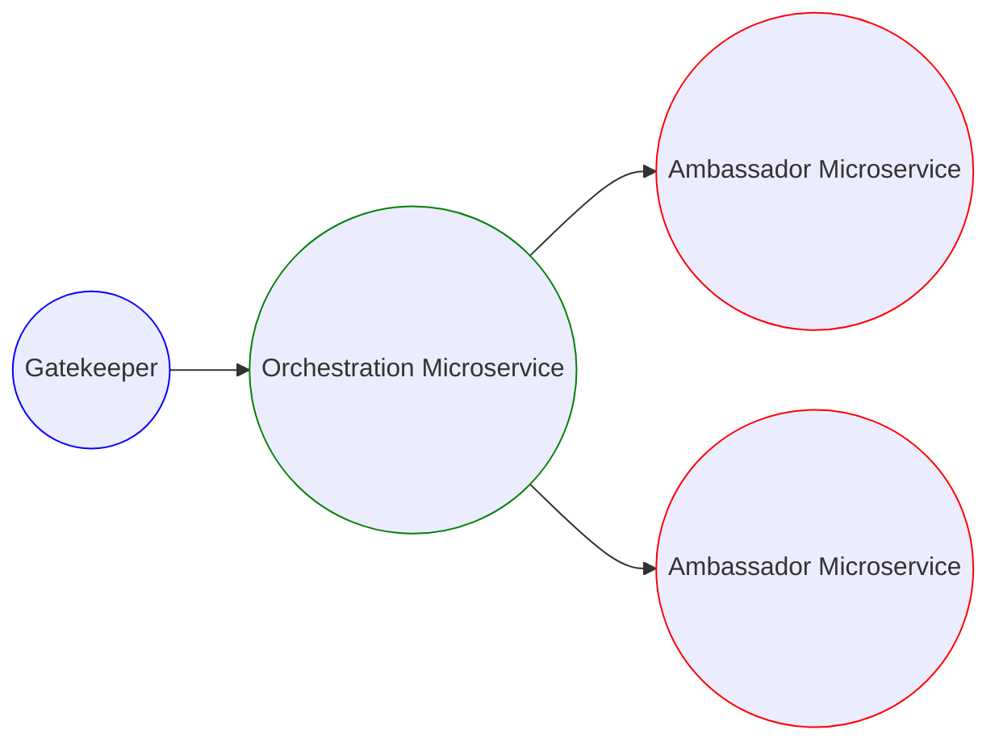

# 0.0 The Theory

## 0.0.0 Introduction
When designing any system, it is of utmost importance for designers to back up their design with a particular theory. Theories play a massive role in ensuring their design's purposes, models, and simulations are cohesive and extensible within a specific domain.

No matter how chaotic it may seem, any system is influenced by at least one theory created by the designer or inherited from previous designers or their methods.
Regardless of what or who the influencer may be, the designer needs to understand the theory they follow fully. Otherwise, it will negatively impact their future decisions regarding extending their design to keep up with a forever-changing and expanding universe.

Early on, I realized that the simpler any theory is, the easier it becomes for other designers to adapt and extend its reach beyond the original designer's dreams. A universe built on simpler patterns can make it much easier for those who marvel at its beauty to understand and appreciate it more than those who give in to the fact that it's complex beyond their comprehension.

A theory about the universe could make life much more purposeful and enriched with tales about survival, evolution, and fulfillment.

## 0.0.1 Finding Answers
Early on in my life, I struggled with schooling. Nothing that was taught to me made any sense to me. Everyone at school seemed more concerned with memorizing and regurgitating what they've memorized during their exam than truly understanding what was taught, questioning its origins, and validating its purposes.

I realized at an earlier age that I needed some magical equation to help me distinguish between what's true and what's not, right and wrong, what is driven by a purpose, and what's an imitation for those with an actual purpose.

I was named all kinds of names during my schooling years. But I didn't mind much of that because my heart, mind, and body were fully invested in finding the answer to everything. So, I started my search to develop a theory that could explain the world to me.

When looking for answers, keeping your heart and mind open to all options is essential. Don't let any social or traditional structures limit your mind from seeking the truth about the universe and embracing the answers from everywhere.

After years of searching, I settled on a theory that made it simple for a simple person like myself to understand everything. I called it The Tri-Nature of Everything.

## 0.0.2 Tri-Nature
The Tri-Nature theory states that everything in this world comprises three main categories: dependencies, purposes, and exposures. Each component is crucial to its system's survival, evolution, and fulfillment.

Let's talk about these components here.

### 0.0.2.0 Purpose
Everything around us has a purpose. It was created and designed with a specific reason in the mind of its creator. We design cars to take us from point A to point B. We design cups for drinking, plates for eating, and shoes for walking. Everything has a core purpose that governs its design and legitimizes its existence.

### 0.0.2.1 Dependency
However, every system must have a dependency in one form or another. For instance, we, as biological systems, rely on food and water to survive. Cars rely on oil or electricity. Computer systems rely on power and electricity, and so on. Regardless of its impact and importance, every method must have a dependency, whether small or big.

### 0.0.2.2 Exposure
Every system must expose itself to allow other systems to integrate and consume its capabilities. However, it must reveal itself somehow to become a dependency for different systems to rely on it. For instance, power outlets are an exposure layer for power sources to allow other systems to plug in and consume their services. Gas stations are exposure layers for underground oil tanks to store that oil.

### 0.0.3 Everything is Connected
In the larger scheme of things, all systems are connected. A simple example of this is the food chain in nature. The sun is a dependency for the grass to grow; grasshoppers are grass consumers, while frogs feed on grasshoppers, snakes feed off of frogs, and so on.

Every food chain member is a system with dependencies, purposes, and exposure.

 
	

		
	

 

Since computer systems are nothing but a reflection of our reality, these systems integrations represent a chain of infinite dependencies where each one of these systems relies on one or more systems to fulfill its purpose. A simple mobile application could rely on a backend system to persist its data. However, the backend system relies on a cloud-based system to store the data. And the cloud-based system relies on a file system to perform basic persistence operations and so on.

### 0.0.4 Fractal Pattern
The Tri-Nature pattern of Things could also be perceived at the smallest and largest scales of any system. Every system is infinitely comprised of three components, each of which has three components, and so on. That's what we call a fractal pattern.

For instance, the smallest known component in the universe is the quarks within a neutron within an atom. These quarks are three components: two down quarks and one up quark. But if you zoom out slightly, you will see that the more extensive system where these quarks reside also comprises three components: electrons, protons, and neutrons.

If we zoom far out from the sub-atomic level to the solar system, the pattern continues to repeat at a massive scale. Our solar system is comprised of the sun, planets, and moons. They fall within the dependency purposing and exposure patterns as the components in the sub-atomic level as follows:

And if we zoom further out at scale, we find that galaxies are made of dust, gas, and dark matter.

The Tri-Nature pattern continues to repeat itself in every aspect of our lives. Every component in our universe, from the smallest sub-atomic parts to the scale of galaxies and solar systems, follows the same rule.

### 0.0.5 Systems Design & Architecture
It is now evident that we can follow a theory to design systems! We can now develop every component in our software according to The Tri-Nature of Everything. The rules and guidelines that govern software design according to the theory are called the Standard. It refers to the universal standard in designing systems in every matter.

The Standard dictates at the low-level architecture that every system out there should be comprised of brokers (dependencies) and services (purposes), as well as exposers (exposures).

For instance, when designing a simple RESTful API, we may need to integrate with a database system, validate incoming data based on specific business rules, and expose these capabilities to the outside world so that the API consumers can integrate with it.

According to The Standard, that system would look like this:

The same pattern would repeat itself when digging deeper into these components. For instance, a service is comprised of validation components, processing components, and integration components. And then, if we zoom in a bit further, these same validation components are comprised of three more refined components: structural, logical, and external. The pattern continues to go on and on to the lowest level of our design, as shown here:

 
	

		
	

 

The same pattern also applies to larger systems if we zoom out of the one system realm into distributed modern systems such as microservice architectures - the same pattern should apply as follows:

In a distributed system, some services act as ambassadors to external or local resources, equivalent to a broker component at the service level. However, a purpose-driven component must come into play to orchestrate business flows by combining one or many primitive resource-consumption operations from these ambassador services. The final part is the exposure layer, a thin gatekeeper layer that becomes the first point of contact between the outside world and your microservice architecture.

The same pattern of Tri-Nature will continue to repeat itself across several systems, may it be large across multiple organizations or small within one single service.

### 0.0.6 Conclusion
In conclusion, The Tri-Nature of Everything is the theory that powers up The Standard. The Tri-Nature theory heavily influences every single aspect of the rules and guidelines of The Standard. But it's important to understand that the theory goes beyond designing some software system. It can apply to management styles, writing books, making meals, establishing relationships, and every other aspect of our lives, which goes beyond the purpose of The Standard here.

After so many years of research and experimentation with the Tri-Nature theory, it is evident now that it works! It helps simplify some of the most complex systems out there. It plays well with our intuition as human beings. It makes it even simpler for automatons in the future to expedite our development processes of software and hardware and everything else in between.

Finally, The Standard is an ongoing journey of questioning The Tri-Nature theory. The further we go into uncharted waters in business domains, the more we discover some new territories where my theory still stands. Even for the most chaotic systems out there, the theory applies in specific ways, even if the components of said systems don't entirely adhere to The Standard form of distinction.
